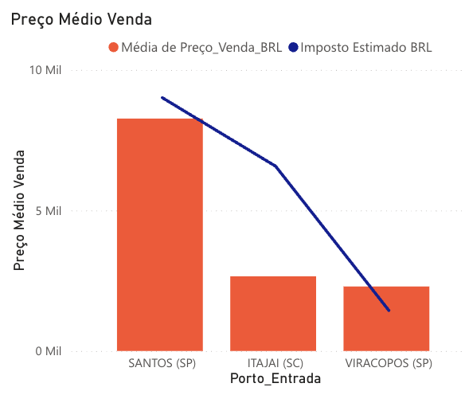
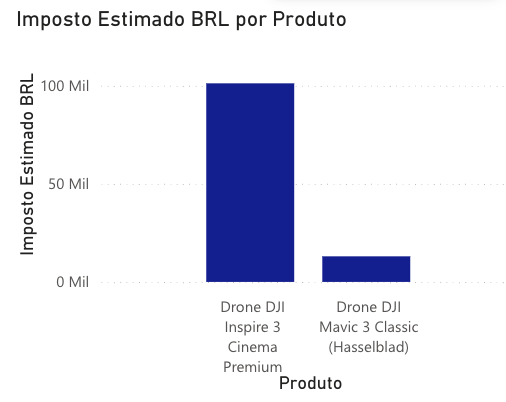
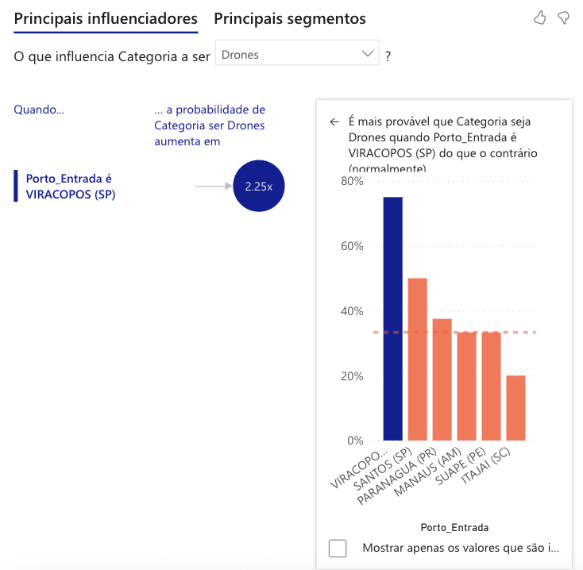
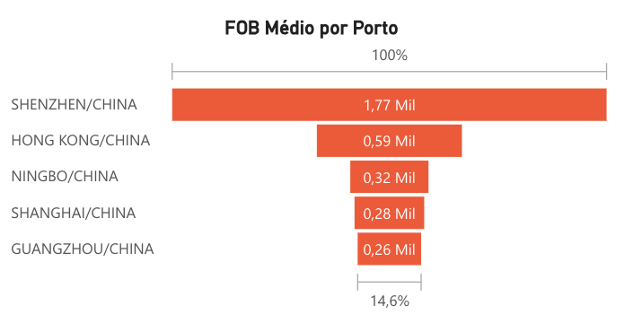

# 📊 COMEX.IO — Import Hunter

## 👩‍💼 Contexto do Projeto

O projeto COMEX.IO surge a partir de um desafio proposto pelo Sr. Roberto, diretor de compras.

Ele precisava responder à seguinte pergunta:

> Qual é o valor FOB dos drones comprados pelos concorrentes na China para decidir se vale a pena importá-los?

FOB (*Free On Board*) representa o valor do produto na origem, sem incluir frete, impostos ou qualquer custo adicional. Literalmente, significa “a bordo”.

O grande desafio foi que não tínhamos acesso às notas fiscais nem aos custos reais pagos pelos concorrentes.

Nosso papel foi utilizar **engenharia reversa financeira** para estimar esses valores a partir do preço final de venda.

---

# 📊 Dashboard de Performance

Antes de apresentar a tabela de engenharia reversa, desenvolvemos um dashboard com métricas estratégicas para apoiar a análise.

## 🔎 Visão Geral (Sem Filtros)

  

Nesta visão consolidada, analisamos:

- Margem Bruta Real
- Margem Bruta Esperada
- Markup
- Markup Real
- ROI (Retorno sobre Investimento)
- Valor de Mercado
- Custo China Estimado

### 📌 Pontos observados:

- Existe pequena diferença entre margem esperada e margem real.
- Essa diferença pode representar oportunidade de negociação de impostos ou melhoria logística.
- O ROI geral permanece acima de 120%.

A categoria Drones, quando filtrada, eleva esse indicador para aproximadamente 122%, mostrando forte impacto positivo na operação.

---

## 🚢 Análise por Porto de Entrada

  
  

Ao observar o gráfico de preço médio por porto:

- A maioria dos drones entra por Viracopos (SP).
- Smartphones entram majoritariamente por Santos (SP).

Essa decisão está relacionada ao peso dos produtos e ao custo logístico.

Produtos de maior valor agregado conseguem absorver melhor o custo aéreo, enquanto produtos mais pesados podem reduzir significativamente a margem.

---

## 🧾 Impacto dos Impostos

  
    

O gráfico de rosca mostra que drones possuem maior peso proporcional sobre impostos devido ao valor agregado.

O gráfico de barras evidencia os produtos com maior valor e, consequentemente, maior impacto tributário — nossos "vilões" fiscais.

  
    

---

# 🔁 Engenharia Reversa — Estimativa de FOB

Para estimar o valor FOB, utilizamos dados reais de venda (via API do Mercado Livre) e aplicamos premissas de impostos e margens.

## 📌 Premissas Utilizadas

- Impostos estimados:
  - 60% para Drones
  - 75% para Smartphones
- Margens estimadas:
  - 40% para Drones
  - 20% para Smartphones

## 📊 Tabela Analítica

  

A tabela apresenta:

- Preço real de venda
- Venda sem margem
- Venda sem imposto
- FOB USD via Markup
- FOB USD via Engenharia Reversa

### 🔎 Duas formas de cálculo

- **FOB via Markup** → cálculo baseado no custo (visão da área de compras).
- **FOB Engenharia Reversa** → cálculo removendo margens e impostos assumidos (visão financeira).

O cálculo via markup pode gerar distorção na percepção do impacto tributário. Por isso, optamos por apresentar ambas as perspectivas para apoiar diferentes áreas da empresa.

---

# 🤖 Insights com IA

Utilizando análise de influenciadores e árvore de decomposição, identificamos:

  

- Probabilidade 2,25x maior da categoria ser Drones quando o porto de entrada é Viracopos (SP).

  

  

Essa análise complementa os gráficos anteriores e ajuda a entender padrões operacionais.

---

# 🌏 Portos de Origem — Análise de Risco

  

O gráfico de funil mostra que Shenzhen concentra praticamente 100% do FOB médio analisado.

Isso pode representar:

- Oportunidade de negociação
- Dependência geográfica
- Risco logístico em caso de crises, greves ou mudanças econômicas

---

# 🎯 Conclusão

Mesmo sem acesso às notas fiscais ou aos custos reais dos concorrentes, por meio da engenharia reversa foi possível materializar informações que apoiam a tomada de decisão sobre importar ou não produtos da China.

Além de apresentar os custos passo a passo, o dashboard trouxe indicadores que geram insights para:

- Negociação
- Precificação
- Logística
- Gestão de risco

O projeto demonstra capacidade analítica, modelagem financeira e transformação de dados em suporte estratégico para o negócio.

## 🔄 Pipeline de Dados

O projeto foi dividido em duas frentes complementares:

1. Coleta e tratamento inicial via script (API + Google Sheets)
2. Modelagem analítica e construção do dashboard no Power BI

A coleta dos dados foi realizada via API do Mercado Livre, utilizando script para automatizar a extração e organizar as informações em Google Sheets.

Após essa etapa, os dados passaram por validação, padronização e modelagem no Power BI, onde foram criadas as métricas, KPIs e análises exploratórias apresentadas no dashboard.

## 🔗 Links Úteis 

# 💻 Repositório Técnico

A etapa de coleta e automação via API pode ser consultada no repositório técnico do projeto:

🔗 [Repositório Tech Comex](https://github.com/ithiagojs/comex-site-v2)

🌐 [Site Comex](https://import-hunter.vercel.app/)

📑 [Sheets com a base de Dados](https://docs.google.com/spreadsheets/d/1XmZuiNUZMyYHbPke7uMoERvs3WeGM2ayMoiSdAgiNZM/edit?usp=sharing)

🗄 [Streamlit de referência com os dados - Luiz Chiavini](https://comexio.streamlit.app/)

